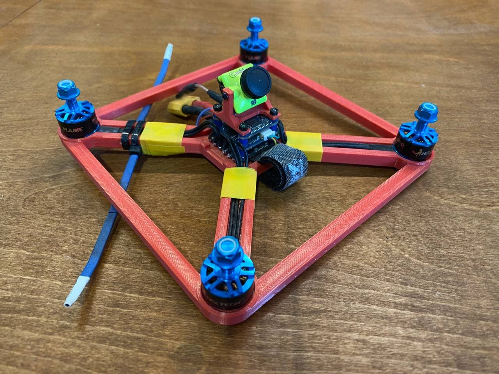

# 3dpqf

3d printable (parameterised) quadcopter frames.

- customisable
- easy (and fast) to print
- cheap

## Builds

### 4", 250g, 3S

Second iteration of this design afer the first version was [unceremoniously destroyed by a chainlink
fence](images/chainlink_fence.jpg). AUW is actually a touch over 250g (I got a little carried away with reinforcements),
but it shouldn't be difficult at all to get the weight down.

- Frame: [stl](https://github.com/wridgers/3dpqf/blob/853ce7e3d206bff679461b3c3df70e9eaa053d3c/stl/4in_250g.stl)
	- PLA
	- 100% infill
	- 43g (£0.86)
	- 4 hour print time
- Camera mount: [stl](https://github.com/wridgers/3dpqf/blob/c94b3af4f0cada7ee6d1a34e5d3afb4f25a937ab/stl/20mm_by_20mm_camera_mount.stl)
- Motor: [HGLRC Flame 1407 3600KV](https://www.banggood.com/HGLRC-Flame-1407-3600KV-3-4S-Brushless-Motor-for-3-Inch-RC-Drone-FPV-Racing-p-1216300.html)
- Stack: [iFlight SucceX F4 V3 Mini](https://www.banggood.com/IFlight-SucceX-F4-V3-Mini-Flight-Controller-35A-Blheli_32-2-6S-ESC-5_8G-25-or-100-or-200mW-Smartaudio-VTX-p-1381613.html)
- Camera: [Caddx Turbo Micro F2](https://www.banggood.com/Caddx-Turbo-Micro-F2-1-or-3-inch-CMOS-2_1mm-1200TVL-16-9-or-4-3-NTSC-or-PAL-Low-Latency-FPV-Camera-W-or-Microphone-p-1328481.html)
- Prop: [Gemfan WinDancer 4032](https://www.banggood.com/2-Pairs-Gemfan-WinDancer-4032-4x3_2x3-3-blade-4-Inch-Propeller-PC-CW-CCW-for-RC-Drone-FPV-Racing-p-1470342.html)

## License

[CC BY-NC 4.0](https://creativecommons.org/licenses/by-nc/4.0/)
